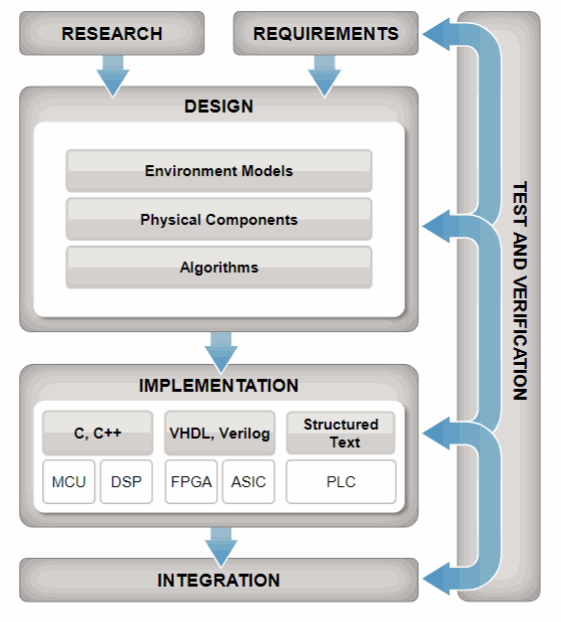
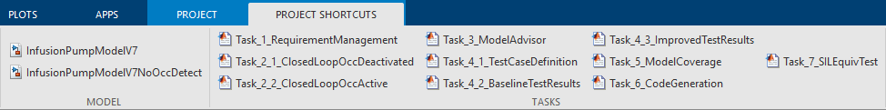

# Model-Based Design and Verification for Infusion Pump

## Infusion Pump Overview:

Infusion pump is a medical device used to deliver fluids (medication or nutrients) into a patient's body in a controlled manner.
There are several types of infusion pumps distinguished by being either, manual, or semiautomatic or fully automatic. 
In manual pumps, the flow control depends on the pressure created as result of gravity, since it consists in two liquid reservoirs and a three-way stopcock used to regulate the flow manually, which differs from the semiautomatic type which in turn is automatically controlled by a set of LED/phototransistor counting the number of times the beam is interrupted and emitting alarms. 
The automatic pumps are used when a better precision is needed. In this modeling example, a syringe mechanism is used to serve as the fluid reservoir. DC motor is used to manage liquid movement through positioning the plunger. 

## Model-Based Design in Medical Device:

The Medical Device community is increasingly looking towards modeling and simulation techniques used in other safety-critical applications to reduce design risks and reduce probability of device recalls, in an environment of ever-increasing system and software complexity. 
Model-Based Design is a simulation-based software development environment that incorporates verification and validation into the workflow. As a result, the functionality of the software is comprehensively tested and verified before you integrate it into a medical device. In addition, most of the documentation required by IEC 62304 standard are automatically created for regulatory compliance.

Model-Based Design is not new and has been been used for many years by the Aerospace,Automotive and Transportation industries for developing safety critical software systems. This project provides principles of model based design through the example of an infusion pump and simulating its dynamics. Using Simulink, Stateflow and Simscape, we can build, simulate, implment and test any dynamics system and understand the behavior of any device. 

For more information on model-based design workflows in medical devices, please feel free to read the following whitepapers: 

1. [Model-Based Design for Medical Devices ](https://www.mathworks.com/content/dam/mathworks/white-paper/gated/model-based-design-medical-devices-white-paper.pdf)
2. [Best practices for IEC 62304 compliance with Model-Based Design](https://www.mathworks.com/content/dam/mathworks/white-paper/using-mbd-iec-62304-compliant-software-dev-process-whitepaper.pdf)

## Getting Started

##### 1. Open the project file InfusionPump.prj. This task will organize project folders, set path and provides shortcuts

##### 2. To view top level model, open InfusionPumpModelV7.slx located within "Models" folder of this project. One can also use project shortcut to open this model.

## What's Included

This project covers many short examples of critical model based design workflow. As, you can see from figure below, except realtime simulation/testing and cerrtification, we have provided all other examples. Please follow scripts below to execute each segment of the workflow.

**[i] Requirement Management:** Click on 'Task_1_RequirementManagement' from project shortcut. This task will open original system level requirmenet document (Syringe Infusion Pump Delivery Logic Requirement.docx), model with requirements are tied to it and final report genereted which shows traceability between requirement and models
    
**[ii] Algorithm Design:** Open a high level infusion pump model which contains plant and controller models by clicking on 'Task_2_1_ClosedLoopOccDeactivated' or 'Task_2_2_ClosedLoopOccActive'. Simulink, Stateflow and Simscape products are used to build this model.
    
**[iii] Modeling Standards:** The MathWorks 'Model Advisor' assists the developer in reporting violations of block settings, model configurations, or modeling styles (readability) that do not comply with such guidelines. 'Task_3_ModelAdvisor' opens model advisor toolbox for infusion pump top level model. User can select/deselect checks
    
**[iv] Simulink Test:** Tasks_4_1, Tasks_4_2 and Tasks_4_3 are related to simulink test. Unit test, baseline test and report generations examples are covered in these three tasks.
    
**[v] Simulink Coverage:** 'Task_5_ModelCoverage' initiate simulink design verifier and shows workflow to automatically generate extended test cases to make sure design has been completely tested with 100% coverage. 
    
**[vi] Code Generation:** 'Task_6_CodeGeneration' generates code for Infusion pump software model which includes supervisory logic, occlusion detection and motor controller.
    
**[vii] SIL/PIL Testing:** 'Task_7_SILEquivTest' test numerically equivalency between motor controller model and generated code.

**[viii] Parameter Sweep & Parallel Processing:** 'Task_8_ParameterSweep' save the results for the occlusion detection test with various critical parameter variation. This script implemented to run this parameter sweep using parallel processing (through local workers) to expedite test data generation process. 

 Model Based Design Workflow examples: 

## Contents

#### Infusion Pump Model: InfusionPumpModelV7.slx

The simulation of the infusion pump physical model, command generator, and its control. Run this model to simulate the controller. 

#### Plant Model: InfusionPumpPlantModel.slx

DC motor and drive system have been implemented to depress plunger. 

#### Software/Controller Model: InfusionPumpSoftwareModel.slx

Contains motor controller, occlusion detection and supervisory logic. Goal is to deliver fluids into patient's body in a controlled manner. Supervisory logic is primarily used to control fluides into patient's body. Motor controller is used to drive DC motor and drive system. Occlusion detection detects resistance in delivery line.

## Videos and Files

#### Modeling an Infusion Pump -- Video Series
https://www.mathworks.com/videos/series/modeling-an-infusion-pump.html

## Contact Us

If you have any issue or need trial licenses to access this project, please reach out to your MATHWORKS account manager or send email to medical@mathworks.com

====================================================
====================================================

_The license is available in the License file within this repository_
_Copyright 2022 The MathWorks, Inc._

